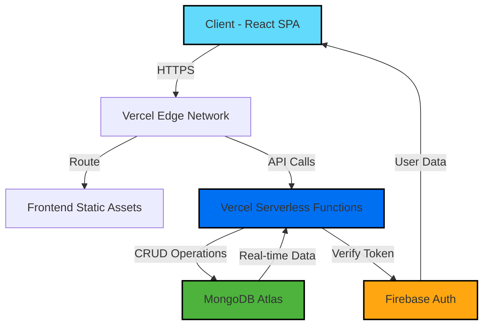

<div align="center">

# 🌱 EcoTrack
### *MERN Full-Stack Demo - Empowering Environmental Action Through Community Engagement*

[](https://eco-track-peach.vercel.app)
[](https://eco-track-backend-delta.vercel.app/api/)

<br/>


<br/>

**A full-stack web application that connects environmentally-conscious individuals through challenges, events, and community-driven sustainability initiatives.**

[🎯 Features](#-features) • [🛠️ Tech Stack](#️-tech-stack) • [🏗️ Architecture](#️-architecture) • [📸 Screenshots](#-screenshots)

</div>

---

## 📋 Overview

EcoTrack is a comprehensive environmental action platform that enables users to participate in eco-challenges, organize community events, and track their environmental impact. The application features a modern, responsive interface with robust authentication and real-time data synchronization.

### 🎯 Key Highlights

- **Full-Stack Implementation**: Complete frontend and backend architecture
- **Secure Authentication**: Firebase Authentication with Google OAuth & Email/Password
- **Scalable Database**: MongoDB with optimized indexing and atomic operations
- **Serverless Deployment**: Vercel Edge Functions for optimal performance
- **Production-Ready**: Comprehensive error handling, validation, and security measures

---

## ✨ Features

### 🔐 User Access Levels

<table>
<tr>
<td width="33%">

#### 🌍 **Public Access**
- Browse eco-challenges
- View community events
- Explore sustainability tips
- See community statistics

</td>
<td width="33%">

#### 👤 **Authenticated Users**
- Join/leave challenges
- Register for events
- Create challenges & events
- Save favorite tips
- Track personal impact

</td>
<td width="33%">

#### 👨‍💼 **Event Creators**
- Manage own events
- Edit event details
- View participant lists
- Monitor registrations
- Cancel/complete events

</td>
</tr>
</table>

### 🎨 Core Modules

| Module | Description | Key Features |
|--------|-------------|--------------|
| **🏆 Challenges** | Sustainable habit-building challenges | Categories, duration tracking, participant counting, featured highlights |
| **📅 Events** | Community environmental events | Capacity management, location-based, organizer details, real-time availability |
| **💡 Tips** | Eco-friendly lifestyle guidance | Curated content, category filtering, save functionality |
| **👥 Community** | User engagement & statistics | Participant tracking, impact metrics, community leaderboards |
| **⚙️ Dashboard** | Personal activity management | My events, joined challenges, profile settings |

---

## 🛠️ Tech Stack

### Frontend Architecture

```
React 19.1 + Vite 7.1 + TailwindCSS 3.4
├── State Management: Context API + Custom Hooks
├── Routing: React Router DOM v7
├── Forms: React Hook Form + Zod Validation
├── UI Components: Custom Component Library
├── Icons: Lucide React + React Icons
├── Notifications: React Hot Toast
└── Animations: Swiper.js for Carousels
```

**Frontend Technologies:**
- **⚛️ React 19.1** - Latest React with Concurrent Features
- **⚡ Vite 7.1** - Lightning-fast build tool & HMR
- **🎨 TailwindCSS 3.4** - Utility-first CSS framework
- **🗺️ React Router DOM v7** - Client-side routing
- **📝 React Hook Form** - Performant form handling
- **✅ Zod** - TypeScript-first schema validation
- **🔥 Firebase SDK 12.5** - Authentication & User Management
- **🌐 Axios** - HTTP client with interceptors

### Backend Architecture

```
Node.js + Express + MongoDB (Serverless)
├── Authentication: Firebase Admin SDK
├── Database: MongoDB Native Driver
├── API Design: RESTful with proper status codes
├── Security: Token verification, input sanitization
├── Performance: Atomic operations, indexing
└── Deployment: Vercel Serverless Functions
```

**Backend Technologies:**
- **🟢 Node.js + Express** - Server runtime & framework
- **🍃 MongoDB** - NoSQL database with native driver
- **🔐 Firebase Admin SDK** - Server-side authentication
- **☁️ Vercel Functions** - Serverless deployment
- **🔒 CORS** - Cross-origin resource sharing
- **🛡️ Input Validation** - Server-side data validation

---

## 🏗️ Architecture

### System Design



### API Architecture

**RESTful API Design** with 20+ endpoints across 2 main resources:

#### 🗂️ Challenges API (10 Endpoints)
```
GET     /api/challenges              → List all challenges
GET     /api/challenges/:id          → Get challenge details
POST    /api/challenges              → Create challenge (Auth)
PUT     /api/challenges/:id          → Update challenge (Creator)
DELETE  /api/challenges/:id          → Delete challenge (Creator)
POST    /api/challenges/:id/join     → Join challenge (Auth)
POST    /api/challenges/:id/leave    → Leave challenge (Auth)
GET     /api/challenges/my-challenges → User's created challenges
GET     /api/challenges/my-joined    → User's joined challenges
GET     /api/challenges/:id/participants → Participant list
```

#### 📅 Events API (10 Endpoints)
```
GET     /api/events                  → List all events
GET     /api/events/:id              → Get event details
POST    /api/events                  → Create event (Auth)
PUT     /api/events/:id              → Update event (Creator)
DELETE  /api/events/:id              → Delete event (Creator)
POST    /api/events/:id/join         → Register for event (Auth)
POST    /api/events/:id/leave        → Unregister from event (Auth)
GET     /api/events/my-events        → User's created events
GET     /api/events/my-joined        → User's registered events
GET     /api/events/:id/participants → Event attendees
```

### Database Schema

**MongoDB Collections with Optimized Indexing:**

```javascript
// Challenges Collection
{
  id: "unique-slug",
  category: "Waste Reduction",
  title: "Plastic-Free Week",
  participants: [{userId, joinedAt, status}],
  registeredParticipants: 1240,
  startDate: "2025-03-01",
  endDate: "2025-03-08",
  featured: true,
  status: "active",
  createdBy: "firebase_uid"
}

// Events Collection
{
  id: "unique-slug",
  title: "City Tree Planting",
  date: ISODate,
  location: "Portland, OR",
  capacity: 100,
  registeredParticipants: 32,
  participants: [{userId, joinedAt, status}],
  createdBy: "firebase_uid"
}
```

**Performance Optimizations:**
- Compound indexes on `status + date`
- Text search indexes on `title`, `description`, `location`
- Atomic operations (`$inc`, `$push`, `$set`) for concurrent updates
- Participant array indexing for fast lookups

---

## 🎨 User Interface

### Design Principles
- **Responsive First**: Mobile, tablet, and desktop optimized
- **Accessibility**: WCAG 2.1 AA compliant
- **Performance**: Lazy loading, code splitting, image optimization
- **User Experience**: Intuitive navigation, clear feedback, loading states

### Component Architecture
```
src/
├── components/       # Reusable UI components
│   ├── ChallengeCard, EventCard, TipCard
│   ├── Navbar, Footer, Hero
│   └── ui/          # Base components (Button, Card)
├── pages/           # Route components
├── hooks/           # Custom React hooks
├── context/         # Global state (AuthContext)
├── services/        # API communication
└── utils/           # Helper functions
```

---

## 🚀 Deployment & DevOps

### Hosting Infrastructure
- **Frontend**: Vercel (Global CDN, Edge Network)
- **Backend API**: Vercel Serverless Functions
- **Database**: MongoDB Atlas (Multi-region)
- **Authentication**: Firebase Cloud
- **Images**: Unsplash CDN

### Environment Configuration
```env
# Firebase Authentication
VITE_FIREBASE_API_KEY
VITE_FIREBASE_AUTH_DOMAIN
VITE_FIREBASE_PROJECT_ID

# API Configuration
VITE_API_BASE_URL=https://eco-track-backend-delta.vercel.app/api

# External Services
VITE_UNSPLASH_BASE_URL
```

---

## 📸 Screenshots

<div align="center">

### 🏠 Home Page - Hero Section
*Engaging landing with featured challenges and community statistics*

### 🏆 Challenges Dashboard
*Browse, filter, and join eco-challenges with real-time participant counts*

### 📅 Events Management
*Create and manage environmental events with capacity tracking*

### 👤 User Dashboard
*Track personal activities, joined challenges, and impact metrics*

</div>

---

## 🔒 Security Features

| Feature | Implementation |
|---------|----------------|
| **Authentication** | Firebase Auth with secure token verification |
| **Authorization** | Role-based access control (Public, User, Creator) |
| **Input Validation** | Server-side validation with Zod schemas |
| **XSS Protection** | Sanitized inputs and escaped outputs |
| **CSRF Protection** | Token-based request validation |
| **Rate Limiting** | API throttling to prevent abuse |
| **Data Privacy** | Minimal data collection, secure storage |

---

## 📊 Technical Achievements

✅ **Full-Stack Development**: End-to-end implementation from UI to database  
✅ **RESTful API**: 20+ endpoints with proper HTTP methods and status codes  
✅ **Atomic Operations**: Race-condition-free participant counting  
✅ **Responsive Design**: Mobile-first approach with TailwindCSS  
✅ **Authentication Flow**: Secure Firebase integration with JWT  
✅ **State Management**: Context API with custom hooks  
✅ **Form Handling**: React Hook Form with Zod validation  
✅ **Error Handling**: Comprehensive error boundaries and user feedback  
✅ **Performance**: Code splitting, lazy loading, optimized queries  
✅ **SEO Ready**: Dynamic meta tags and semantic HTML  

---

## 🌐 Live Links

<div align="center">

### [🚀 Live Application](https://eco-track-peach.vercel.app)
### [⚡ API Endpoint](https://eco-track-backend-delta.vercel.app/api/)

</div>

---

## 👨‍💻 Developer

<div align="center">

### **Omar Faruk**
*Full-Stack Web Developer specializing in React, Node.js, and MongoDB*

[](https://www.linkedin.com/in/omar-expert-webdeveloper/)
[](https://omarfaruk.dev/)

</div>

---

## 📝 Technical Documentation

### API Specifications
- **Challenge API**: Full CRUD operations with atomic participant management
- **Event API**: Capacity-controlled registrations with real-time availability
- **Authentication**: Firebase token verification on all protected routes

### Development Highlights
- Modern React patterns (hooks, context, custom hooks)
- Server-side rendering-ready architecture
- Comprehensive error handling and validation
- Production-grade security measures
- Scalable and maintainable codebase

---

## 🎯 Project Scope

This project demonstrates proficiency in:

**Frontend Development**
- React 19 with modern hooks and patterns
- Advanced state management with Context API
- Form handling with validation
- Responsive design with TailwindCSS
- Client-side routing with React Router

**Backend Development**
- RESTful API design and implementation
- MongoDB database design and optimization
- Authentication and authorization
- Serverless architecture
- Error handling and validation

**DevOps & Deployment**
- Vercel deployment configuration
- Environment management
- Performance optimization
- Security best practices

---

<div align="center">

### 🌟 Built with attention to detail, security, and user experience

*This project showcases modern web development practices and scalable architecture suitable for production environments.*

---

**EcoTrack** © 2025 | Developed by [Omar Faruk](https://omarfaruk.dev/)

</div>
